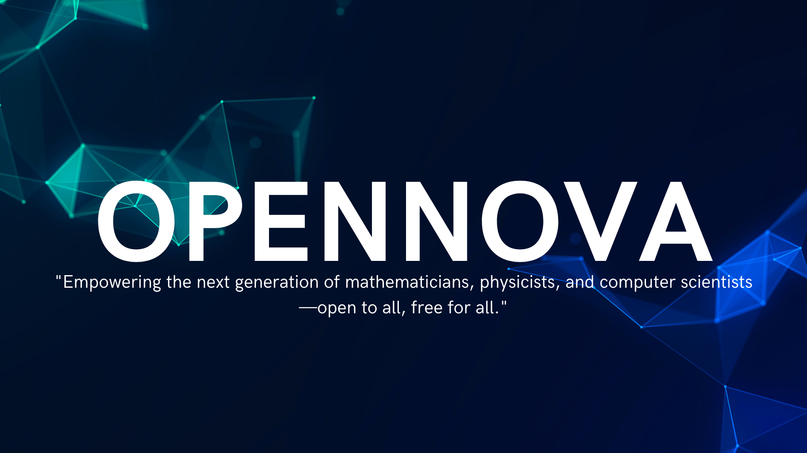

<h3>OpenNova</h3>

  Empowering the next generation of mathematicians, physicists, and computer scientists—open to all, free for all.

  

# Contents

- [Summary](#summary)
- [Prerequisites](#prerequisites)

# Summary

OpenNova is an open-source curriculum designed to document and share the self-taught journey of mastering Computer Science, Mathematics, and Physics at a level equivalent to a **full bachelor's degree** in these fields. This curriculum is inspired by the structure and rigor of [OSSU (Open Source Society University)](https://github.com/ossu) in [CS](https://github.com/ossu/computer-science) and [Mathematics](https://github.com/ossu/math), with an additional focus on Physics to create a holistic foundation for advanced studies and research.

## What is OpenNova?
OpenNova is a living Project (repository) of NovaVerseOrg that evolves with its creator's learning journey. As each course, topic, or resource is completed, it is added to the repository, along with detailed notes, insights, and recommendations. The goal is to:

1. **Guide learners** : Provide a roadmap for others seeking a similar path.
2. **Curate resources** : Share only the most valuable and effective resources for learning.
3. **Build expertise** : Equip learners with skills equivalent to a bachelor’s degree in the three disciplines.

## Why OpenNova?
1. **Multidisciplinary Focus** : Combines CS, Mathematics, and Physics into a unified curriculum, preparing learners for quantum computing, AI, and scientific research.
2. **Real-World Relevance** : The curriculum emphasizes practical and theoretical knowledge, blending applied skills with rigorous academic foundations.
3. **Open and Adaptive** : Unlike static curriculums, OpenNova grows organically as its creator progresses, ensuring that it always reflects up-to-date and firsthand experiences.

## Key Features of OpenNova
1. **Dynamic Learning** : Resources are added only after they have been tested and completed by the creator, ensuring high-quality recommendations.
2. **Comprehensive Coverage** : Aims to match the depth and breadth of a bachelor's degree in CS, Mathematics, and Physics.
3. **Resource Recommendations** : Links to free, open-source, and paid resources (if essential) that helped shape the creator's understanding.

## How to Use OpenNova
1. **Follow the Curriculum** : Start with the basics and work through intermediate and advanced topics.
2. **Leverage the Resources** : Use the curated materials and notes to enhance your learning.
3. **Tackle Projects** : Apply your knowledge in real-world scenarios to solidify your understanding.

## Who is OpenNova For?
- **Self-Taught Learners** : Anyone seeking a structured and comprehensive path to mastering CS, Mathematics, and Physics.
- **Aspiring Researchers**: Those aiming to specialize in areas like quantum computing, AI, or advanced physics.
- **Professionals** : Individuals looking to deepen their knowledge or pivot into technical fields.

## Conclusion
OpenNova is not just a curriculum; it’s a testament to the power of self-learning and the open-source spirit. By following this roadmap, learners can gain an equivalent level of expertise to a **full bachelor's degree in Computer Science, Mathematics, and Physics, while also engaging with cutting-edge fields like quantum computing.** As the journey unfolds, OpenNova will continue to evolve, empowering others to achieve their educational goals.

**Cost**. All or nearly all course material is available for free. However, some courses may charge money for assignments/tests/projects to be graded.
Note that both [Coursera](https://www.coursera.support/s/article/209819033-Apply-for-Financial-Aid-or-a-Scholarship?language=en_US) and [edX](https://courses.edx.org/financial-assistance/) offer financial aid.

# Prerequisites
## OpenNova Prerequisites

OpenNova is more than a platform for learning Computer Science (CS), Mathematics, or Physics it's a journey for those with the ambition to revolutionize these fields. As the owner of OpenNova, my goal is to become a **computer scientist and mathematician specializing in quantum computing**, and I invite like-minded individuals to join this mission.

This platform is specifically designed for learners who aspire to:

1. **Become a computer scientist**
2. **Become a computer scientist and mathematician**
3. **Specialize in a field of CS, Mathematics, or Physics and contribute groundbreaking research or innovations**
4. **Excel as a mathematician or physicist, creating a lasting impact**
5. **Add revolutionary contributions in CS, Physics, or Mathematics**

 

> **Note 1** :- 
> 1.  If your goal is job preparation or gaining a general understanding of these fields, resources like [OSSU CS](https://github.com/ossu/computer-science) and [OSSU Math](https://github.com/ossu/math) are excellent choices. OpenNova, however, is for learners who aim to leave a mark and contribute meaningfully to these disciplines.
> 2. Starting in 2 years Open Nova is focusing on providing Best Structured and best resources curriculum for gaining full bachelor's degree level Skills in Computer Science, Mathematics, and Physics, while also engaging with cutting-edge fields like quantum computing.

 

## 1. Mathematics Prerequisites (via Khan Academy):

> **Note 2** :- We assume That students have 0 Knowledge In mathematics because Future Topics Require a Strong foundation in Algebra and Geometry and This Algebra and Geometry By Khan Academy Will Provide You with Proper Knowledge From Scratch Start With Zero You Can Skip Luctures And give a Test or solve Prictic Questions and if you stuck in any topic then revise that topic and Mester it. 

Mathematics is the backbone of all three fields. Having a strong foundation in mathematics will be invaluable, regardless of the specialization.

For a solid foundation, start with the following courses on **Khan Academy** :

1. [**Algebra**](https://www.khanacademy.org/math/algebra-home)
  - **Purpose** : Teaches foundational skills such as solving equations, manipulating expressions, and understanding functions.
  - **Why It’s Important** : Algebra is critical for building logic, foundational in computer science and quantum mechanics. You’ll use algebra extensively in algorithms, data structures, and quantum physics.
2. [**Geometry**](https://www.khanacademy.org/math/geometry-home)
  - **Purpose** :Focuses on the properties and relationships of shapes, sizes, and spaces.
  - **Why It’s Important** : Geometry sharpens spatial reasoning and visualization skills, valuable in computer graphics, simulations, and physics problems involving spatial dimensions.
3. [**Trigonometry**](https://www.khanacademy.org/math/trigonometry)
  - **Purpose** :Explores the relationships between angles and sides of triangles and introduces periodic functions.
  - **Why It’s Important** : Trigonometry is essential in quantum mechanics (e.g., wave functions, oscillations) and fields like computer vision and signal processing.
4. [**Precalculus**](https://www.khanacademy.org/math/precalculus)
  - **Purpose** :Prepares you for calculus by covering advanced algebra, functions, and an introduction to limits.
  - **Why It’s Important** : Precalculus bridges the gap to calculus, which is fundamental for advanced physics, machine learning, and quantum computing.

After covering Algebra , Geomatry , trignometry , precalcus and mester this topics 
These courses will establish a robust mathematical foundation necessary for deeper exploration into advanced topics in Computer Science, Mathematics, and Physics.

## 2. Introduction to Mathematical Thinking :
Most people's views of mathematics are destroyed in school by focusing on memorization and regurgitation. But ***mathematicians see math as an elegant way to explain the world around us***. This class covers how to think like a mathematician and solve problems. 

**Topics covered:**
`Mathematical mindset`
`Number Theory`
`Logical reasoning`
`Abstract thinking`
`Problem-solving approaches`
`Proof techniques (essential for higher mathematics)`

Courses | Duration | Effort | Prerequisites
:-- | :--: | :--: | :--:
[Introduction to Mathematical Thinking](https://www.coursera.org/learn/mathematical-thinking) | 10 weeks | 4 hours/week | none

### Why It’s Important ?
Essential for understanding advanced math topics like abstract algebra, calculus, and linear algebra.
> Helps bridge the gap between "doing math" (basic calculations) and "thinking mathematically," which is crucial for research and theoretical understanding.

Great preparation for tackling rigorous proofs and mathematical formalism in quantum computing and theoretical computer science.

### When to Start:
You can begin Mathematical Thinking after completing Algebra, Geometry, and Trigonometry from Khan Academy. These topics give you the basic tools you'll need to understand the course content.

## 3. Technical Documentation:
LaTeX is a document preparation system used widely in academic and scientific communities. 
**Topics covered:**
`How to create professional-looking documents with mathematical formulas, equations, and formatting.`
`How to structure papers for research, assignments, or even books.`

Courses | Duration | Effort | Prerequisites
:-- | :--: | :--: | :--:
[LaTeX](https://www.overleaf.com/learn/latex/Learn_LaTeX_in_30_minutes) | 1 week | 30 minutes/week | none

### Why It’s Important ?
Essential for anyone writing research papers, academic reports, or books in mathematics, physics, or computer science. LaTeX is often required for formatting in journals, theses, and technical publications.

### When to Start :
You can start learning LaTeX immediately, as it does not require advanced math knowledge.
Start with basic knowledge, and as you progress in math, you can integrate more advanced features (e.g., complex equations, and diagrams).

